<!-- Guide Title and Logo Row -->
<div style="display: flex; align-items: center; justify-content: space-between; margin-bottom: 1.5em;">
  <h1 style="margin: 0; font-size: 2em;">Workday MCP — Deployment and install guide</h1>
  
</div>

## Table of contents

- [Introduction](#introduction)
- [Definitions](#definitions)
- [Prerequisites / Required tools & access](#prerequisites--required-tools--access)
- [Installation procedure](#installation-procedure)
- [Post-installation actions](#post-installation-actions)
- [Troubleshooting / Escalation procedures](#troubleshooting--escalation-procedures)
- [References / Related documents](#references--related-documents)
- [Revision history](#revision-history)

---

## Introduction

### Purpose

This guide explains how to deploy a **read-only Workday MCP** that provides authoritative workforce context to downstream identity and device workflows. The deployment is designed to improve visibility and drift detection without enabling any HR record modification.

### Audience

HRIS owners, IAM and AD owners, Security, and Deskside or IT Operations teams responsible for identity governance and integration controls.

### Scope

This guide covers phased implementation of a Workday Context MCP from governance alignment through operational controls. It intentionally excludes any capability to perform HR write actions.

The MCP in this guide:

- Observes workforce data through scoped read-only endpoints
- Correlates workforce state with AD, Entra, and device context
- Supports human-approved remediation through downstream IT-owned systems

The MCP in this guide does not:

- Provision users
- Trigger hires or terminations
- Modify worker records
- Replace PECI or existing HR integrations

---

## Definitions

| Term | Definition |
| --- | --- |
| **MCP** | Model Context Protocol interface exposing approved tools and context to AI clients |
| **Workday MCP** | Read-only MCP server that surfaces workforce attributes from Workday for downstream identity reasoning |
| **HRIS** | Human Resources Information System; Workday is the source-of-truth HRIS in this design |
| **ISU** | Integration System User in Workday used for API-based integration access |
| **Identity drift** | Mismatch between authoritative workforce state and downstream identity or access state |
| **Source of Truth (SoT)** | Authoritative system of record; Workday remains SoT for workforce status |

---

## Prerequisites / Required tools & access

Complete all prerequisites before implementation work begins.

- [ ] Security and HR sign-off on read-only contextual access
- [ ] Stakeholder alignment across HRIS, IAM or AD owners, Security, and IT Ops
- [ ] Workday Integration System User (ISU) created for the MCP service
- [ ] OAuth 2.0 or approved API credential method configured
- [ ] API access scoped to GET-only endpoints
- [ ] Repository established for version-controlled tool manifests
- [ ] Logging destination approved for request-level audit events

> **No AI-facing deployment begins until governance agreements are documented and approved.**

---

## Installation procedure

Deploy the Workday MCP in seven controlled phases.

```mermaid
flowchart LR
    phase-governance[Phase 0: Governance and alignment] --> phase-foundation[Phase 1: Integration foundation]
    phase-foundation --> phase-tools[Phase 2: Tool surface definition]
    phase-tools --> phase-validation[Phase 3: Read-only validation]
    phase-validation --> phase-correlation[Phase 4: Correlation with identity]
    phase-correlation --> phase-remediation[Phase 5: Human-approved remediation]
    phase-remediation --> phase-controls[Phase 6: Audit and lifecycle controls]
```



| Phase | Capability | Risk level |
| --- | --- | --- |
| 0 | Governance and read-only agreement | None |
| 1 | Integration foundation | Low |
| 2 | Approved tool surface and field scope | Low |
| 3 | Drift detection and read-only validation | Low |
| 4 | Cross-system correlation | Low |
| 5 | Human-approved remediation orchestration | Medium (controlled) |
| 6 | Audit and lifecycle controls | Low |

---

### Step 1: Governance and alignment (Phase 0)

**Objective:** Establish ownership boundaries and non-negotiable control agreements before technical build.

1. Confirm required stakeholders are assigned and accountable:
    - HRIS (Workday owner)
    - IAM or AD owners
    - Security
    - Deskside or IT Ops
2. Record and approve the following agreements:
    - Workday remains the sole Source of Truth for workforce status
    - MCP access is read-only
    - Identity actions remain IT-owned
    - MCP insights may recommend but do not execute
3. Obtain Security and HR sign-off on read-only contextual access.

✅ **Exit criteria:** Signed governance agreement with read-only scope and ownership boundaries.

---

### Step 2: Integration foundation (Phase 1)

**Objective:** Build a secure Workday MCP integration layer without exposing AI tooling yet.

1. Configure a dedicated Workday ISU for the MCP server.
2. Configure OAuth 2.0 (or approved equivalent) for API authentication.
3. Restrict access to GET-only endpoints required for approved context fields.
4. Confirm there is no custom UI access and no background mutation jobs.

✅ **Exit criteria:** Workday MCP server can authenticate and retrieve data through read-only API paths only.

---

### Step 3: Tool surface definition (Phase 2)

**Objective:** Expose only identity-relevant workforce context under least privilege.

1. Implement the approved core tools:

    ```powershell
    workday.getWorker(identifier)
    workday.getWorkerStatus(identifier)
    workday.getWorkerOrgAttributes(identifier)
    workday.getWorkerManager(identifier)
    workday.getWorkerEffectiveDates(identifier)
    ```

2. Limit output fields to:
    - Worker ID
    - Name and email
    - Employment status (active, terminated, future-dated)
    - Job profile
    - Cost center or department
    - Location
    - Manager
3. Explicitly exclude:
    - Compensation
    - Performance
    - Benefits
    - Payroll
    - Medical and protected fields
4. Validate field exposure with HRIS policy owners.

✅ **Exit criteria:** HR confirms exposed fields align to least-privilege policy.

---

### Step 4: Read-only validation and drift detection (Phase 3)

**Objective:** Prove the MCP can detect drift accurately without triggering changes.

1. Validate representative read-only scenarios:
    - User active in AD but terminated in Workday
    - User manager mismatch between AD and Workday
    - Future-dated hires missing in AD
    - Contractor end date passed in Workday
2. Document expected versus actual results for each validation case.
3. Confirm all outputs are informational only and do not trigger remediation actions.

✅ **Exit criteria:** Workday MCP reliably answers identity-state questions with no write behavior.

---

### Step 5: Correlation with Identity MCP (Phase 4)

**Objective:** Enable AI reasoning across workforce, identity, and device context.

1. Integrate data flow in this order:
    - Workday MCP (Source of Truth)
    - Identity MCP (AD and Entra state)
    - Device or access decision context (for reporting and recommendations)
2. Validate cross-system insights, including:
    - Who should exist versus who does exist
    - Users with access who are no longer employees
    - Future-dated hires that should not be provisioned yet
3. Confirm Workday MCP remains context-only and never issues AD updates.

✅ **Exit criteria:** Cross-system insights are accurate and no direct identity writes originate from Workday MCP.

---

### Step 6: Human-approved remediation workflows (Phase 5)

**Objective:** Use detected drift to support existing SOPs while preserving separation of duties.

1. Implement the operational pattern:

    ```text
    1. AI detects mismatch
    2. AI explains cause (Workday vs AD or Entra)
    3. Human selects remediation path
    4. Identity MCP or existing automation executes
    5. Ticket is updated with result
    ```

2. Ensure remediation remains in IT-owned systems and not in Workday MCP.
3. Validate tickets include decision, execution details, and closure evidence.

✅ **Exit criteria:** Remediation is human-approved, auditable, and executed by approved downstream systems.

---

### Step 7: Audit, security, and lifecycle controls (Phase 6)

**Objective:** Harden operational controls for steady-state use.

1. Enable request-level logging for every MCP invocation.
2. Record at minimum: tool name, parameters, timestamp, and result status.
3. Ensure no expansion of PII beyond approved fields.
4. Version-control all tool definitions and review changes through standard change control.
5. Validate for Workday release cycles and schema changes before production rollout changes.
6. Rotate integration credentials per policy and restrict server access to approved hosts.

✅ **Exit criteria:** Logging, change management, and access lifecycle controls are operating and verified.

---

## Post-installation actions

- Run a weekly control review for the first 60 days after go-live.
- Review drift-detection false positives and tune query logic where needed.
- Reconfirm field-level scope with HRIS and Security before adding any new tool.
- Re-validate after each Workday release window and after identity schema changes.
- Keep remediation SOP references current and linked to ticket templates.

---

## Troubleshooting / Escalation procedures

| Issue | Resolution |
| --- | --- |
| Workday MCP authentication fails | Verify ISU status, OAuth credentials, token scope, and API endpoint allow-list. |
| Tool returns incomplete worker attributes | Confirm requested fields are in approved scope and available in Workday API response mapping. |
| Drift query results appear inconsistent with AD | Validate identity correlation key mapping (worker ID, email, or employee ID) and check for stale cache. |
| Read-only contract is violated by a new tool proposal | Reject deployment, remove tool from manifest, and route through security and HR governance review. |
| Audit log entries missing | Pause production use until logging is restored and event flow validation passes. |
| Unexpected PII appears in output | Immediately disable affected tool, remove unapproved fields, and complete incident review. |

**Support Contact:** Raise a ticket with IT Automation and include HRIS owner review if policy scope or data classification is involved.

---

## References / Related documents

- [Model Context Protocol MCP — Developer guide (sqlservercentral.com)](https://www.sqlservercentral.com/articles/model-context-protocol-mcp-a-developers-guide-to-long-context-llm-integration)
- [Model Context Protocol guide (artificialintelligenceschool.com)](https://artificialintelligenceschool.com/model-context-protocol-mcp-guide/)
- [MCP servers explained (dev.to)](https://dev.to/jamie_thompson/mcp-servers-explained-how-ai-assistants-connect-to-your-tools-598o)

---

## Revision history

| Version | Date | Author | Description |
| --- | --- | --- | --- |
| v1 | 2026-03-11 | N. Castaldi | Initial draft |
